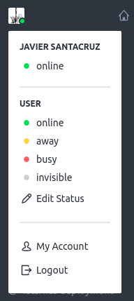
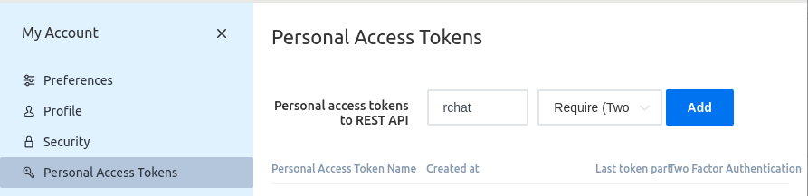
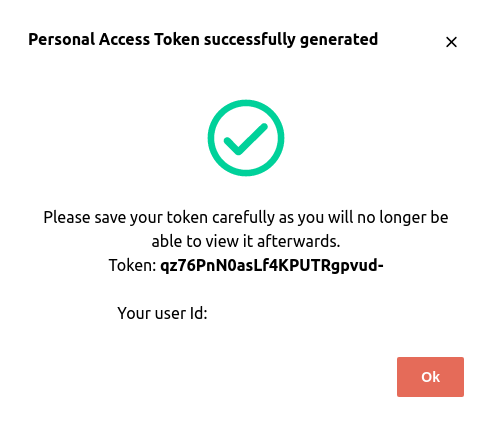

# rchat

[](https://www.gnu.org/licenses/gpl-3.0)

A simple RocketChat command line client

    rchat send --to #team "Hello World!"

## Usage

_rchat_ comes with a command line interface that allows you to send messages
either to groups or direct people:

    rchat send --to @rita.cantaora "Hi Rita!"

The message can also be piped into the program via stdin:

    echo "Hi!" | rchat send --to #team

For the common case of sending a verbatim text, a `--code` flag can be passed
so the message is formatted as markdown code block:

    cat script.py | rchat send --to @helper --code --lang python

See help for more information:

See `rchat --help`.

## Configuration

_rchat_ needs to know at least the server url and user credentials to use the
API. Those parameters can be given via _command line option_, set using an
_envvar_ or by setting them in a _config file_.

See [how to create your token](#create-token) and get the user id.

### Config file

To configure via file, place your parameters in [toml][] format at
`~/.config/rchat/config.toml`:

```toml
[rchat]
user_id = 'a1d3f4dd..'
token = 'fjXkkf..'
url = 'https://rocketchat.myserver.net'
```

Extra config files can be placed in the `conf.d` directory and all of them will
be merged together using [confight](https://github.com/avature/confight). Last
values found in these files will override the previous ones, so the complete
list of places to be searched, in the order that will be read are:

- `/etc/rchat/config.toml`
- `/etc/rchat/conf.d/*`
- `~/.config/rchat/config.toml`
- `~/.config/rchat/conf.d`

Meaning that the keys in files placed at `~/.config/rchat/conf.d` will override
the rest.

A specific config file can be given by passing the `--config` option or setting
the `RCHAT_CONFIG` envvar.

#### Aliases

Use shorter names for certain contacts by declaring them in the config file:

    [rchat.aliases]
    "my-alias" = "@full-long-name"

The string "my-alias" will then be expanded to "@full-long-name" before a
message is sent:

    rchat send --to my-alias "Hi!"

### Environment Variable

Settings can also be set as a environment variable by prefixing them with
`RCHAT_` such as in `RCHAT_USER_ID`. Arguments set this way will take
precedence over the ones in the config file but will be overriden by the ones
in command line.

### Command line

Base configuration options can be taken from the command line.
Arguments given in the command line will override any other configuration.

    --user TEXT      Username in RocketChat
    --user-id TEXT   User id associated to a Token
    --token TEXT     Personal Acces Token Name
    --password TEXT  Password for user in RocketChat
    --url TEXT       Url to the RocketChat server

This can come handing sometimes but is not recommended to pass tokens in the
command line, they're stored in bash history or can be seen as part of the
process information.

[toml]: https://github.com/toml-lang/toml

## Create Token

You'll need a `user_id` and `token` pair to make rchat work with your RocketChat instance.

The steps are:

1. Go to `Profile -> My Account -> Security -> Personal Access Tokens`
2. Create a new token
3. Copy the User Id and Token (you won't be able to see them later).

Check out the [RocketChat
documentation](https://docs.rocket.chat/api/rest-api/personal-access-tokens) on
how to get a token for more info.





## Development

From the root of the application directory, create a python environment,
install the application in development mode along with its dependencies and
run it locally:

    pip install poetry
    poetry shell
    poetry install

Tests can be run using *tox* (recommended):

    pip install tox
    tox

Or directly by calling *py.test*:

    python -m pytest

## TODO

- [X] Send private messages
- [X] Send message from stdin
- [X] Send message from files
- [ ] Upload files
- [ ] Upload images
- [ ] Read messages
- [ ] Listen to new messages
- [ ] Autocomplete emojis
- [ ] Autocomplete users
- [ ] Autocomplete channels
- [X] Config file
- [ ] Logging and debug
- [X] Debian Packaging
- [ ] Bundled Packaging
- [X] Pypi version
- [X] Versioning script
- [ ] Improve startup time
- [ ] Define groups of users
- [X] User aliases
- [ ] Allow to get reactions
- [ ] Allow for threads
- [ ] Implement (pre|post) message hooks
- [ ] Implement (pre|post) reaction hooks
- [ ] Autocomplete names
- [ ] Autocomplete channels
- [ ] Open editor to compose message
- [ ] Preview message in markdown viewer
- [ ] Autoformat input as verbatim
